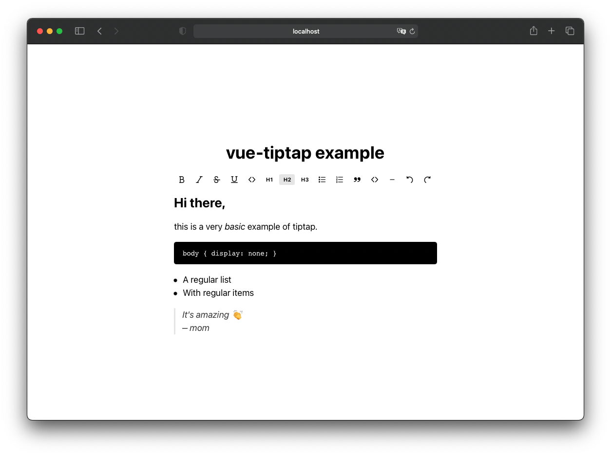

# vue-tiptap

[](https://www.npmjs.com/package/vue-tiptap)
[](https://www.npmjs.com/package/vue-tiptap)
[](https://github.com/neverbot/vue-tiptap/blob/master/LICENSE.md)
[](https://www.npmjs.com/package/vue-tiptap)

Example of using [tiptap 2](https://github.com/scrumpy/tiptap/) as a Vue 3 component without being completely renderless, so you can see how to use it inside your own components or even use it right away. It can be imported as a Vue 3 component, and you can see in the `example` directory how it would be used inside your application.

**Note**: now tiptap has their own examples and components for different frameworks (including vue 2 and vue 3), so maybe you should take a look to the official package [@tiptap/vue-3](https://tiptap.dev/installation/vue3). This package will not be updated anymore.



## Install and Usage

```bash

# install dependencies
npm install

# build component
npm build

# serve demo
npm serve
```

## License

The MIT License (MIT). Please see [License File](LICENSE.md) for more information.

SVG Icons from the original [TipTap](https://github.com/scrumpy/tiptap/) package.
